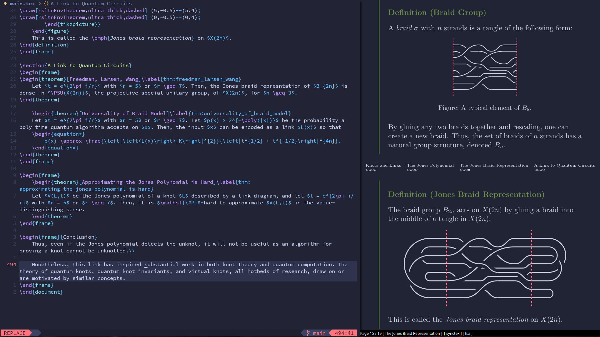
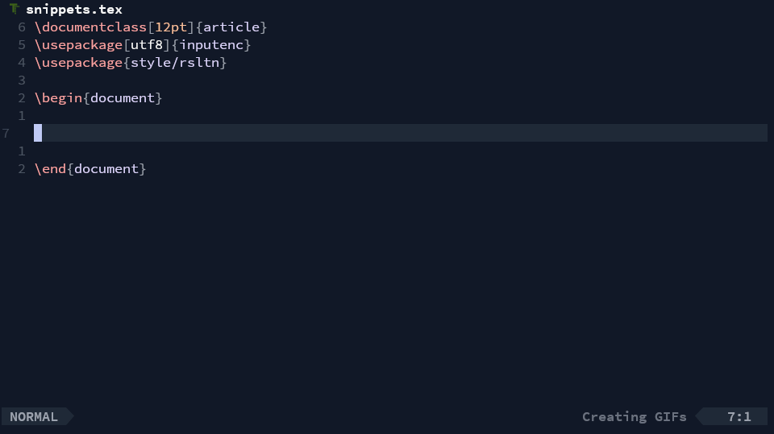
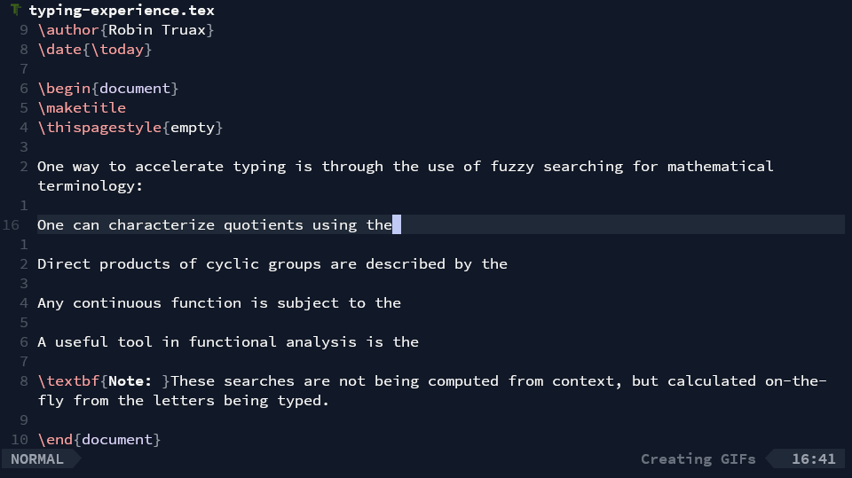
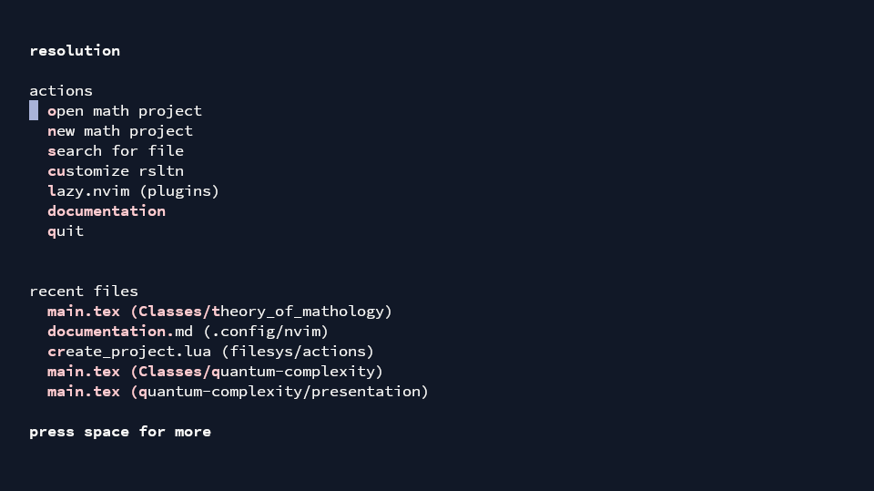
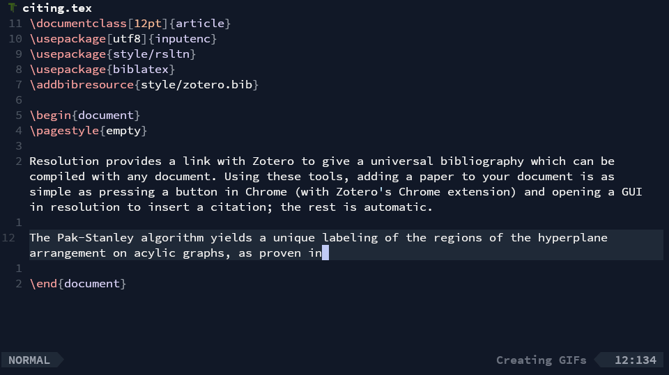
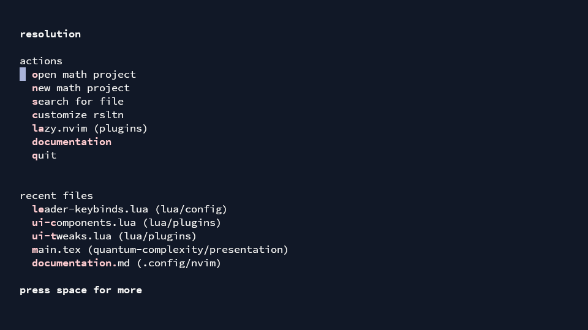
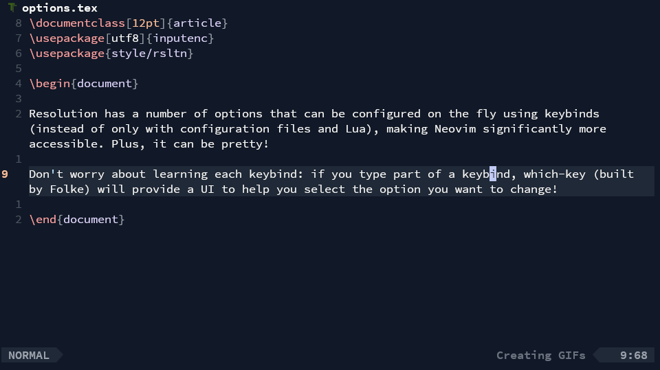

# `rsltn`: write better $\LaTeX$ faster.

## Introduction

`rsltn` (pronounced *resolution*) is a fast, beautiful, and functional development environment for writing math built on Neovim.
`rsltn` stands for **R**oshan's **S**ystem for **L**a**T**eX in **N**eovim, but the name also refers to the goal of the project, the *resolution* of the two main steps in the process of creating math: experimentation and exposition.
<figure>

<figcaption><code>rsltn</code> being used to edit a Beamer presentation in the <code>tokyonight</code> theme.</figcaption>
</figure>

Indeed, `rsltn` both improves the experience of quickly writing beautiful math with LaTeX and provides tools for experimenting and computing in two interactive spaces (the Napkin and the Notebook). However, the most unique functionality of `rsltn` is the seamless integration *between* the two processes. 

### Demonstrations
In this section, we give some demonstrations of `rsltn`'s functionality: 

<big><b>Computations</b></big>

This video shows *the Napkin*, a tool for performing symbolic computations and manipulations in $\LaTeX$. The Napkin can be launched in any document using `<space>c`. It coexists with the Notebook, a larger interactive computational environment for experimentation.

 

<big><b>Snippets</b></big>

<table style="table-layout: fixed;">
<tr>
</tr>
<tr>
<td>

One way `rsltn` improves $\LaTeX$-writing is *snippets*. By creating shortcuts for common tasks such as defining an equation environment or definition environment, `rsltn` speeds up LaTeX-writing, automates repetitive tasks, improves keyboard ergonomics, and helps users remember common snippets of code.

</td>
<td>

</td>
</tr>
</table>

 

<big><b>Fuzzy Completion</b></big>

Another tool `rsltn` implements is an extensible dictionary which is used as a fuzzy-search completion engine when someone is typing. In simple terms, when one is typing a word, `rsltn` will search over the dictionary of over 10,000 words or phrases to guess what you're typing to type.

 

<big><b>Navigation</b></big>

`rsltn` gives various navigation tools: project and file previews, pop-ups for jumping to definitions, theorems, or sections in the document or the project, and the powerful "peek" functionality which allows one to check (or edit) the source for any reference while staying in place.

 

<big><b>File System</b></big>

<table style="table-layout: fixed;">

`rsltn` comes with a simple file management tool. Using various keybinds, one can quickly create, archive, or navigate through a project or file. Using symbolic links, `rsltn` also ensures any project created a computer automatically has access to `rsltn`'s beautiful provided style files, and a central bibliography without adding additional dependencies. 

 

<big><b>Citations</b></big>

`rsltn` also simplifies the citation process with a central bibliography and citation picker. This bibliography is fed by Zotero, meaning you'll never need to learn bibtex syntax: just press a single button in Zotero's Chrome, Firefox, Edge, or Safari extension, and `rsltn`'s central bibliography will add the paper, ready to be cited..

 

<big><b>Keymaps</b></big>

`rsltn` has built-in tools for exploring the tree of keybinds or searching for a specific operation; thus, you'll always know how to quickly execute the operation you're looking for.

 

<big><b>Options</b></big>

`rsltn` has a number of options that can be configured on the fly using keybinds (instead of only with configuration files and Lua), making Neovim significantly more accessible.

