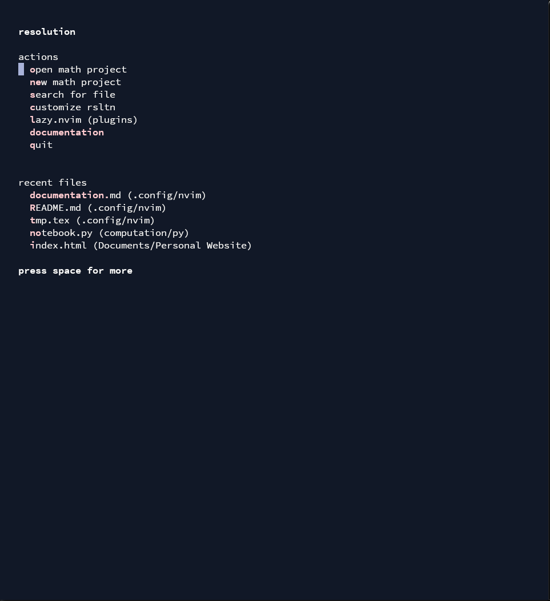

# `rsltn`: write better LaTeX faster.

## Introduction

`rsltn` (pronounced *resolution*) is a fast, beautiful, and functional development environment for writing math built on Neovim.
`rsltn` stands for **R**oshan's **S**ystem for **L**a**T**eX in **N**eovim, but the name also refers to the goal of the project, the *resolution* of the two main steps in the process of creating math: experimentation and exposition.
<figure>

<figcaption><code>rsltn</code> being used to edit a Beamer presentation in the <code>tokyonight</code> theme.</figcaption>
</figure>

Indeed, `rsltn` both improves the experience of quickly writing beautiful math with LaTeX and provides tools for experimenting and computing in two interactive spaces (the Napkin and the Notebook). However, the most unique functionality of `rsltn` is the seamless integration *between* the two processes. 

### Demonstrations
In this section, we give some demonstrations of `rsltn`'s functionality: 

<details open>
<summary><big><b>Computations</b></big></summary>

This video shows *the Napkin*, a tool for performing symbolic computations and manipulations in $\LaTeX$. The Napkin can be launched in any document using `<space>c`. It coexists with the Notebook, a larger interactive computational environment for experimentation.


</details>

<br>

<details>
<summary><big><b>Snippets</b></big></summary>

One way `rsltn` improves $\LaTeX$-writing is *snippets*. By creating shortcuts for common tasks such as defining an equation environment or definition environment, `rsltn` speeds up LaTeX-writing, automates repetitive tasks, improves keyboard ergonomics, and helps users remember common snippets of code.


</details>

<br>

<details>
<summary><big><b>Fuzzy Completion</b></big></summary>

Another tool `rsltn` implements is an extensible dictionary which is used as a fuzzy-search completion engine when someone is typing. In simple terms, when one is typing a word, `rsltn` will search over the dictionary of over 10,000 words or phrases to guess what you're typing to type.


</details>

<br>

<details>
<summary><big><b>Navigation</b></big></summary>

`rsltn` gives various navigation tools: project and file previews, pop-ups for jumping to definitions, theorems, or sections in the document or the project, and the powerful "peek" functionality which allows one to check (or edit) the source for any reference while staying in place.


</details>

<br>

<details>
<summary><big><b>File System</b></big></summary>

`rsltn` comes with a simple file management tool. Using various keybinds, one can quickly create, archive, or navigate through a project or file. Using symbolic links, `rsltn` also ensures any project created a computer automatically has access to `rsltn`'s beautiful provided style files, and a central bibliography.


</details>

<br>

<details>
<summary><big><b>Citations</b></big></summary>

`rsltn` also simplifies the citation process with a central bibliography and citation picker. This bibliography is fed by Zotero, meaning you'll never need to learn bibtex syntax: just press a single button in Zotero's Chrome, Firefox, Edge, or Safari extension, and `rsltn`'s central bibliography will add the paper, ready to be cited..


</details>

<br>

<details>
<summary><big><b>Keymaps</b></big></summary>

`rsltn` has built-in tools for exploring the tree of keybinds or searching for a specific operation; thus, you'll always know how to quickly execute the operation you're looking for.


</details>

<br>

<details>
<summary><big><b>Options</b></big></summary>

`rsltn` has a number of options that can be configured on the fly using keybinds (instead of only with configuration files and Lua), making Neovim significantly more accessible.


</details>

## Table of Contents
The remainder of this document will help walk you through the installation of `rsltn` and its dependencies.

1. [**Introduction**](#introduction)
2. [**Installation**](#installation)
3. [**Basic Editing**](#basic-editing)
4. [**Summary of Commands**](#overview-of-commands)
5. [**The Napkin and the Notebook**](#the-napkin-and-the-notebook)
6. [**Snippets**](#snippets)
7. [**Built-In Style File**](#built-in-style-file)
8. [**Troubleshooting**](#troubleshooting)
9. [**Configuration and Extension**](#configuration-and-extension)

## Installation

`rsltn` runs on all major operating systems. The process of installing `rsltn` is two-part: (1) the installation of the basic system, and (2) the installation of various dependencies.

#### Basic System
1. **Install Neovim**: Install Neovim 0.9 or later. You can either install the terminal UI (recommended) or Neovide, a GUI for Neovim (not tested, but might offer a better Windows experience). For the former, visit [this link](https://github.com/neovim/neovim/wiki/installing-Neovim#install-from-download), and for the latter, visit [this link](https://github.com/neovide/neovide/releases/latest); select your OS, download, and install the application. Then, make sure that it is accessible in your `PATH` by running `nvim` in your terminal. If it's not working, add it to your `PATH` and, if necessary, an alias. Instructions for modifying your `PATH` are [here](https://gist.github.com/nex3/c395b2f8fd4b02068be37c961301caa7).
2. **Locate Configuration Location**: Determine your Neovim configuration path. On Linux and Mac, the configuration path is usually `~/.config/nvim`, and on Windows the configuration path is usually `~/AppData/Local/nvim`. To know for sure, launch Neovim by running `nvim` in the terminal, press `:` to enter command mode and run `lua=vim.fn.stdpath('config')`; the configuration path will be printed.
3. **Download Configuration Files:** Next, clone this git repository into Neovim's configuration folder.\* On Mac and Linux, this is fairly simple. Open a terminal window and use `cd` to navigate into the configuration folder, and then run `git clone https://github.com/RobinTruax/resolution.git .` On Windows, you may need to install `git` first. Visit [this link](git-scm.com/download/win) to do so. You can then repeat the process described above. (\*If you are already using Neovim, you can clone into a different empty folder, say `rsltn/`, in the folder one directory above Neovim's configuration folder. Then, you can launch `rsltn` with `NVIM_APPNAME=rsltn nvim`, and your existing configuration will be preserved and accessible with `nvim`). 
4. **Auto-Install Plugins and Packages:** Next, open Neovim again. A number of messages should appear showing that a number of packages are being downloaded into the configuration folder. After they've stopped, close Neovim and reopen it. You should be met with a screen of the following sort and (hopefully) no errors.<br>

5. **Set Project Root Path:** Open `rsltn`, and navigate to `customize rsltn`. Enter the `preferences.lua` file. Set the variable `prefs.project_root_path` to the folder you want to store your math projects in (preferably empty). I chose to create a `Mathematics` folder in my `Documents` folder, and used that.

#### Dependencies and Add-Ons

The basic system of `rsltn` is now installed, but some dependencies must be installed for it to work to its fullest. There are a number of dependencies because `rsltn` is integrated with a number of other tools and programming languages. 
1. **TeXLive 2023+ (Required):** This is a comprehensive distribution of of $\LaTeX$. Install it on Mac or Linux [here](https://tug.org/texlive/quickinstall.html) or on Windows [here](https://tug.org/texlive/windows.html). Add it to your path and check that it's installed and up to date by running `tex`.
2. **Python 3.9+ (Required):** Python is required for numerous plugins and operations; you can download it [here](https://www.python.org/downloads) if it's not already installed. Ensure that it's installed (and has a sufficient version) by running `python` in the terminal. Then, run `pip install pynvim` to install the remote plugin API for Python and Neovim and `pip install sympy` to install SymPy.
3. **Jupyter (Required):** Install Jupyter with the commands `pip install ipykernel`, `pip install jupyterlab`, and `pip install jupyter_client`. Make sure that the Jupyter kernel has been added to your `PATH` by running `jupyter --version` and checking that both `ipython` and `jupyter_client` appear.
4. **Sioyek (Required):** Install Sioyek, the PDF viewer tested to work well with `rsltn`, [here](https://github.com/ahrm/sioyek/releases/latest). Anything else may require configuration (which is possible, but if possible should be avoided). Sioyek also supports many useful features such as SyncTeX. Open the `preferences.lua` file as discussed above; then, edit the variable `glb.vimtex_view_sioyek_exe` to the location of your Sioyek executable.
5. **Wezterm or Nerd Fonts (Highly Recommended):** For various glyphs to appear properly, you must either install a Nerd Font [here](https://www.nerdfonts.com/) and set your terminal to use it, or install the wezterm terminal emulator, which uses a Nerd Font as a fallback font. Wezterm is also very easily customizable, and is what I use. You can install it [here](https://wezfurlong.org/wezterm/installation.html); then launch `nvim` from within Wezterm. You may want to set it as your default terminal emulator to simplify the launching process.
6. **Swap CAPS and Escape (Highly Recommended):** I *highly* recommend swapping `CAPS` and `Esc`. The Escape key is the most common key you will be pressing; it enters Normal mode in Neovim. On the other hand, there's rarely a good reason to use `CAPS`. Yet `CAPS` is much bigger and closer to your resting position. On Windows, you can use KeyTweak or SharpKeys to swap the keys. On Mac, you can visit System Settings > Keyboard > Keyboard Shortcuts > Modifier Keys to swap the keys. Finally, on Linux, there are a number of solutions provided by [this page](https://askubuntu.com/questions/363346/how-to-permanently-switch-caps-lock-and-esc).
7. **SageMath (Recommended):**  If you want to use the SageMath kernel in the Notebook (which is highly useful), install SageMath [here](https://doc.sagemath.org/html/en/installation/index.html). Then, install the SageMath Jupyter kernel using `sudo jupyter kernelspec install $SAGEMATH/local/share/jupyter/kernels/sagemath`, where `$SAGEMATH` is your SageMath root directory. For more details, see [this StackExchange answer](https://stackoverflow.com/questions/39296020/how-to-install-sagemath-kernel-in-jupyter).
8. **GitHub CLI and LazyGit (Recommended):** If you plan to use GitHub to back up your projects folder (as is built into `rsltn`), install the GitHub CLI using the instructions [here](https://cli.github.com/). Also, if you plan on using git to back up your projects in any way more sophisticated than the monorepo that is built into `rsltn`, I suggest using the lazygit UI; a shortcut for it is built into `rsltn`. You can install lazygit using any of the methods [here](https://github.com/jesseduffield/lazygit#installation). 
9. **Zotero (Recommended):** If you want to use `rsltn`'s integration with Zotero to solve your bibliography woes, first install Zotero and its Chrome, Firefox, Edge, or Safari extension [here](https://www.zotero.org/download/). Then, install Better BibTeX using the instructions [here](https://retorque.re/zotero-better-bibtex/installation/). Then, open Zotero, go to Preferences and open the tab Better BibTeX. You can edit the citation key formula using the documentation [here](https://retorque.re/zotero-better-bibtex/citing/), but it's a purely aesthetic choice. What is critical is going to the automatic export option, enabling it, and selecting "on change". Then, right click "My Library" and select "Export Library". Select the format "Better BibTeX", and choose the location of the resulting file to be `/tex/style/zotero.bib` (in the config folder of Neovim). This will sync up everything automatically for you.

## Basic Editing
This section will introduce you to editing in `rsltn` and Neovim more generally. To learn more, see [this](https://stackoverflow.com/questions/1218390/what-is-your-most-productive-shortcut-with-vim/1220118#1220118) incredible StackOverflow answer.

### Modes
Vim and Neovim are "modal editors". This means that you are always maneuvering between a few "modes": most critically, Normal mode, Insert mode, Visual mode, Replace mode, and Command mode. To see what mode you're in, look at the bottom left. 
 - Insert mode is most similar to your traditional editor. 
 - Normal mode is where you'll delete, copy, paste, and manipulate text, as well as where you'll navigate through your document. 
 - Visual mode is where you select text, and offers more options (at the cost of more required keypresses) for deleting, copying, replacing, etc. 
 - Replace mode is the same as Insert mode, except that instead of inserting text, you're overwriting the text on the screen. 
We'll discuss these modes in greater detail in the following sections.

### Normal Mode
This is the "standard" mode, and is the best place to start in learning Vim keybinds.

There are two things which distinguish Vim keybinds from keybinds in any other platform: 
 - Firstly, they are often sequential. This means, for example, that the keybinding `<space>fc` means "press `<space>`, then press `f`, then press `c`". When one must hold multiple keys at once, this is denoted by a dash; i.e., `<Ctrl>-h` means "hold `<Ctrl>` *and* `h` at once.
 - Secondly, each keybind forms a sentence, with a "verb" and a "subject". The "verb" tells Vim what to do, and the "subject" tells Vim what to do it *to*. An example would be `yiw`. `y` is a verb meaning "yank" (it's Vim's version of "copy"), and `iw` means "in word". Thus, if you're in Normal mode, pressing `yiw` means "yank the 'inside' (meaning no surrounding whitespace) of the word you're in". 

This level of specificity might seem strange, but in fact it is a much more natural way to interact with and edit text. In this section, we discuss various verb and subject keybinds, and then a few other keybinds and modes that are also important. 

#### Verbs
The most important verbs are:
 - `y`: yank (copy)
 - `d`: delete (cut)
 - `c`: delete (cut) and enter insert mode
I'll reiterate this, because it is quite confusing: the delete operation cuts - i.e., copies the deleted text, by default. Later (in the Registers section), we'll discuss how to avoid this, but it is often a pain point. Just remember that you can see your copy history using `<space>sy` whenever you make the inevitable mistake of deleting when you have something important copied.

Usually, verbs are followed by a subject, but there are two special cases: 
 - `Y`/`D` yanks (resp. deletes) until the end of the line.
 - `yy`/`dd` yanks (resp. deletes) the entire line.

#### Subjects
There are two types of subjects in Vim: text objects and movements.

##### Text Objects
Text objects are used for selecting semantic objects, such as words, paragraphs, sentences, LaTeX environments, etc. The following is a list of text objects implemented in `rsltn`: 
 - `w` is a word (string of characters broken up by spaces, dashes, etc.)
 - `W` is a Word (string of characters broken up by spaces only)
 - `s` is a sentence.
 - `p` or `(` or `)` is a string of characters surrounded by parentheses.
 - `r` or `[` or `]` is a string of characters surrounded by rectangular brackets.
 - `c` or `{` or `}` is a string of characters surrounded by curly brackets.
 - `P` is a paragraph.
 - `e` is a LaTeX environment.
 - `$` is a LaTeX math environment (e.g. `$x \cdot y$`).
 - `c` is a LaTeX command.

The way that text objects are used is with either `i` for "in" or `a` for "around"; the difference is essentially whether or not to use whitespace or not. A sentence, then, using a text object subject consists of a verb (`y`/`a`/`d`), either `i` or `a`, and then one of the text objects. Following are some examples: 
 - `yiP` means "copy in the paragraph".
 - `da(` means "delete around the surrounding parentheses".
 - `yi$` means "copy the next section of math".

##### Movements

Text objects set both the beginning and the end of the object to be acted on. On the other hand, movement subjects just use the cursor location for one end, and the other end is specified by a movement. Movements are also important because they don't need to be attached to a verb: a movement keybind can be used to navigate as well as perform actions. Following are the most important movements: 

First, the basic movements: 
 - `h`/`j`/`k`/`l` move left, down, up, and right.
 - `{`/`}` move backward/forward one paragraph.
 - `w`/`e` move to the beginning/end of the next word.
 - `b` moves to the beginning of the previous word.

Next, some linewise movement: 
 - `0` moves to the beginning of the line. 
 - `_` or `^` moves to the beginning of the line excluding whitespace (particularly useful in LaTeX, where indentation is common).
 - `+` moves to the beginning of the next line, excluding whitespace.
 - `$` moves to the end of the line.

Finally, some character-based movement options: 
 - `f`/`F` in Normal mode followed by a key jumps to the next (resp. previous) occurence of that key. You can repeat this command with `;`.
 - `t`/`T` in Normal mode followed by a key jumps to right before the next (resp. previous) occurence of that key. You can repeat this command with `;`.
 - `<Alt>-f`/`<Alt>-F/<Alt>-t/<Alt>-T` in Normal mode are more advanced versions of the previous four commands provided by a plugin called `leap.nvim`. Essentially, you type two characters after the command, and then (if necessary) an additional letter to specify which occurence of these two characters to jump to. It allows one to jump anywhere on the screen in just a few keypresses.

#### Basic Navigation
Since it's such a ubiquitous task, it is worth having a dedicated section on the topic of basic navigation: opening and closing files.

There are a number of ways to open a file. On the launch screen, you will see a list of files recently edited with `rsltn`. You can start typing their names to jump to them or use the up and down keys to navigate to them. More often, you will use one of the following methods: 
 - `<space>v` opens a file in the existing project; if no project is open, it will let the user choose a project. Similarly, `<space>V` lets the user choose a project and then a file. The currently open project is visible in the bottom-right. You will start out with no projects, but the menu for opening projects also lets the user create a new project.
 - `<space>n` lets the user create a new file in the project from a list of templates.
 - `<space>E` opens a sidebar file explorer that can also be used to create, delete, rename, copy, etc. files. Use the keybinding `g?` when your cursor is in the sidebar file explorer to see a list of keybindings.
 - `<space>s` opens a list of options for searching. Important options include `<space>sf` to search all files, `<space>sh` to search all files (inc. hidden files), `<space>sg` and `<space>sG` to search in the file and the project respectively.

As for closing windows, `<space>q` or `:wq` writes and quits the current window. `<space>Q` or `:wqa` writes and quits all current windows.

#### Other
In this section, we'll discuss a few keybinds which don't follow the structure above but are still extremely useful: 
 - `p`/`P` pastes the current select before (resp. after) the cursor's location.
 - `gg` sends the cursor to the first line of document, `G` sends the cursor to the final line of the document, and `#gg` sends the cursor to the `#`th line of the document.
 - `/` (followed by a "pattern" to search for) is Vim's "find" tool. You can navigate forward/backward within matches using `n` and `N`.

Normal mode is the most important and complex mode, but other modes also have their own keybinds, which we'll briefly discuss here. For a shorter overview of what modes do, see [here](#modes).

##### Insert Mode
The only keybinds which work *in* Insert mode are `<Ctrl-V>` for pasting and `<Esc>` for exiting Insert mode (to go back into Normal mode). However, there are still some keybinds relevant to Insert mode: those involved in *entering* it from Normal mode.
 - `i`/`a` enters Insert mode before (resp. after) the cursor.
 - `I`/`A` enters Insert mode at the beginning (resp. end) of the line.
 - `o`/`O` adds a newline before (resp. after) the current line and enters insert mode.
 - `s`/`S` deletes the current character (resp. line) and enters insert mode.

##### Command Mode
`:` enters "command mode". There are too many commands to summarize here, but the most important is the "replace" command. To learn the complicated but powerful syntax of the replace command, see [here](https://linuxize.com/post/vim-find-replace/). 

##### Visual Mode
There are three types of visual modes: normal Visual mode, where the selection is sequential (as you will be used to), Visual-line mode, where the selection is by line, and Visual-block mode, where the selection is a two-dimensional rectangle (thus, for example, you could select just the 11th through 20th character of a series of lines). You enter each as follows: 
 - `v` for normal Visual mode. This is denoted by `VISUAL` in the mode indicator in the bottom left. Note that `v` itself is a verb, so, for example, `vw` selects from the cursor until the beginning of the next word.
 - `V` for Visual line mode. This is denoted by `V-LINE` in the mode indicator in the bottom left.
 - `<Ctrl>-v` for Visual block mode. This is denoted by `V-BLOCK` in the mode indicator in the bottom left.

In visual mode, you can use any of the movement keys discussed earlier, or the mouse, to make a selection. Then, after the selection is made, you can use any of the previously discussed verbs (deletion, yanking, etc.) with a few visual-mode specific variations: 
 - Overwriting a selection of text by pasting over it with `p` is akin to pasting it and then deleting the selection (so, the deleted selection is copied, just as the deleted text is copied when using `d` in normal mode - to avoid this, see the section on [Registers](#registers)).
 - `r` in Visual mode doesn't replace a single character but the entire selection.
 - `I` or `A` in Visual block mode allows one to insert text on every line. To use this, make a selection in Visual block mode, and then press `I` or `A`. Type the text to insert, and then press `<Esc>` to populate the new text on every line in the original selection.

##### Replace Mode
This is a fairly simple mode: it's identical to insert mode, except that it overwrites text instead of inserting it. It is entered with `R`.

#### Registers
"Registers" are Vim's solution to a few problems, most notably (1) wanting to "truly" delete rather than cut text, (2) wanting to paste over text without copying it, and (3) wanting to copy multiple things. Before any operation which deletes or pastes text (most notably `d`, `y`, and `p`), one can specify a register with `"?`, where `?` is the register. The most important register (other than the default one) is `_`, the "black hole register". To truly delete a selection of text, or to overwrite text without copying it, use `"_d` or `"_p`. In `rsltn`, `'` is a shortcut for `"_`. However, other registers can be useful (for macros, once one learns how to use them, for example). By default, Vim uses a different register for the system and for its default, but `rsltn` merges these so that there's less to get used to.

### LaTeX Functionality
Following are the most important commands for $\LaTeX$.
 - `<space>L` starts compiling $\LaTeX$.
 - `<space>F` formats the current $\LaTeX$ file.
 - `<space>S` moves to the corresponding point of your cursor in the PDF.
 - `<space>c` opens the Napkin.
 - `<space>le` opens a list of $\LaTeX$ errors.

## Summary of Commands
Almost all of `rsltn`'s commands are "leader" keybinds. The "leader" key can be changed, but the default (and most sensible choice) is `<space>`, so these commands start with `<space>` followed by two letters. 

The most important idea is that when you press `<space>` in Normal mode and wait, a UI listing all the possible next presses will appear. This is invaluable and will make it easy to learn the keybinds over time. 

This UI is the suggested way to learn `rsltn`'s leader keybinds, which appear in the following categories: 
 - Top-level commands, which are common operations (e.g. jumping between buffers, opening/creating/archiving a project, creating a file, starting LaTeX compilation, etc.). These commands have the form `<space>?`, where `?` is a single letter. Press `<space>` to browse them.
 - Search commands (for finding text in the document or project, searching an undo tree, or a million other search functionalities). These commands have the form `<space>s?`; press `<space>s` to browse them.
 - Option commands (for on-the-fly editing of options). These commands have the form `<space>o?`. Press `<space>o` to browse them.
 - Git or GitHub commands (for built-in Git functionality). These commands have the form `<space>g?`. Press `<space>g` to browse them.

### Other Keybinds
This section has some keybinds which are more advanced (i.e. don't necessarily fall into the category of "basic editing"). These also, of course, appear in both keybind-finding tools (the completion UI and search menu given by `<space>sk`), but since they're more scattered it's worth listing them here.

Firstly, there are a number of keybinds for split and buffer control.
 - `<Ctrl>-h/j/k/l` and `<Ctrl>-Left/Right/Down/Up` will either move the active window in the corresponding direction or create a split in the corresponding direction.
 - `<Alt>-h/j/k/l` and `<Alt>-Left/Right/Down/Up` will resize the current window in the given direction.
 - `<Ctrl>-<Alt>-h/j/k/l` and `<Ctrl>-<Alt>-Left/Right/Down/Up` will swap the current window with the one in the given direction.
 - `H` and `L` will rotate to the next buffer (useful if you just have a few buffers; otherwise the Telescope buffer picker `<space>b` is better).

Another useful tool is the jump list.
The jump list is very useful to return to an area after jumping to make an edit: 
 - `<Ctrl>-o` means go to the previous spot in the jump list.
 - `<Ctrl>-i` means go to the next spot in the jump list.

There are a number of commands which begin with `g`. `g` usually means `go to` (press `g` to see the various options on this front), but a few are particulaly important:
 - `gd` is "go to definition" (it is used on any `\ref` or `\cite` command). 
 - `gr` is "go to references (it is used on any `\label` command). 
 - `ga?` is "align at `?`" (it is used on a visual selection of multiple lines).
 - `gu` is a verb keybind meaning "set lowercase". As usual, `guu` means "set line lowercase".
 - `gU` is a verb keybind meaning "set uppercase". As usual, `gUU` means "set line uppercase".
 - `gc` is a verb keybind meaning "toggle comment".  As usual, `gcc` means "set line comment".

To "fold" text, you can add comments around a section with the text `{{{` and `}}}`. Then, closing the fold will collapse the text. This can be used to hide, say, previous days' lecture notes or sections in a longer paper. Controlling folds is done with commands that begin with `z` (press `z` to browse them).

In `rsltn`, `s` is used for "surrounding" functionality. Precisely: 
 - `sa` is a verb keybind meaning "surround with `?`". For example, `saiw(` means "surround this word with parentheses". Using an opening symbol will insert a space, and using a closing symbol will not.
 - `sd?` is a keybind meaning "delete surrounding `?`".
 - `sr?!` is a keybind meaning "replace surrounding `?` with `!`".

Finally, note that the Napkin and the Notebook have some special commands. These are discussed in the next section.

## The Napkin and the Notebook

In any document, you can open the Napkin with `<space>-c`. This opens a popup; if you had text selected already, it'll be autopopulated into the first space. Any LaTeX you enter in the first space, or any Python (where SymPy and any single-letter symbol is brought into scope) in the second space, will be evaluated as LaTeX, formatted, and displayed in the third space. You can copy it from there, moving around using the `<tab>` key, or you can use one of the built in keybinds: `\s` for sending text to the notebook, `\S` for naming the result and sending it to the notebook, or `\y` for immediately copying the contents of the third space and quitting the window.

Furthermore, in any document in a project folder, you can open the Notebook with `<space>-C`. This opens a popup prompting the user to either open one of the existing pages or create a new page. Select the kernel to be used, and the Notebook will be opened with the Jupyter kernel automatically initialized. The system comes by default with Python and SageMath kernels, but more can be configured. In the Notebook, there are a number of special keybinds: 
 - `\r` to run the current cell.
 - `\R` to run the current cell and move down.
 - `\j` to move one cell down.
 - `\k` to move one cell up.
 - `\v` to visually select a cell.
 - `\c` to comment the cell.
 - `\a` to add a cell above.
 - `\b` to add a cell below.
 - `\y` to copy the cell.
 - `\o` to copy the output of a cell.
 - `\C` to do the usual functionality of `<space>-C`.

Note that a "cell" is just any section of code with no empty lines.

## Snippets

Snippets are short sections of text which can be expanded into standard "snippets" of code. For example, `def` expands to the code for a definition when you press `<tab>`; this is an example of a "manual snippet". This contrasts with an automatic snippet, which expands whenever you type the keys (for example, `mk` expands to the code for an equation environment with no `<tab>` press) and is denoted in the following table with **bold**.

Snippets are the single best way to speed up your LaTeX-writing. Learn the ones here, and configure them or add your own in `/config/snippets.lua`.

The tables following can be read as follows: 
 - Each cell starts with the "trigger": without text decoration if it is manual, **bold** if it is automatic, and *italic* if it is partially automatic (see [here](#sum-style-snipets) for an explanation).
 - It is followed by the expanded version of the snippet; here, the text `<>` denotes an "insert" node; that is, a place where the cursor will jump to to allow for editing. For example, `\sqrt[<>]{<>}` means that the snippet will expand to `\sqrt[]<>`, and place the cursor within the square brackets. The user types the degree of the radical, and presses `<Tab>` to jump to the next insert node to type in the radicand.

#### Environments
This section discusses various snippets for creating environments. These work outside of math mode. The single most important one to remember is `mk` or `km`; two interchangable snippets which automatically expand to an `equation*` environment with the proper spacing and the right cursor placement. Then, one can exit this section of math using `<tab>`. Note that these snippets produce the entire code for an environment, but in this table are just abridged to the environment name. Try them out!

| Environment Snippets |                     |                            |                           |
|----------------------|---------------------|----------------------------|---------------------------|
| beg: generic         | conj: `conjecture`  | mk or km: `equation*`      | itm: `itemize`            |
| def: `definition`    | exam: `example`     | refeq: numbered `equation` | enm: `enumerate`          |
| thm: `theorem`       | prob: `problem`     | ali: `align*`              | aenm: `enumerate` (alpha) |
| prop: `proposition`  | sol: `solution`     | lst `lstlisting`           | renm: `enumerate` (roman) |
| lem: `lemma`         | prf: `proof`        | fig: centered `figure`     | tabl: `table`             |
| cor: `corollary`     | ctr: `center`       | wfig: wrapped `figure`     |                           |

#### Non-Math Commands
This section discusses various snippets for commands that work outside of math mode. Analogously as above, the most important one to remember is `mj` or `jm`; two interchangable snippets which automatically expand to `$$` and places the cursor in the middle. Then, one can exit this section of math using `<tab>`.

| Non-Math Commands    |                           |                                                   |
|----------------------|---------------------------|---------------------------------------------------|
| bf: `\textbf{<>}`    | lab: `\label{<>}`         | exparrow: `\exparrow{<>}{<>}{<>}{<>}`             |
| it: `\emph{<>}`      | ref: `\ref{<>}`           | exparrowadv: `\exparrowadv{<>}{<>}{<>}{<>}{<>}`   |
| ttt: `\texttt{<>}`   | sec: `section`            | exparrowdual: `\exparrowdual{<>}{<>}{<>}{<>}{<>}` |
| tsc: `\textsc{<>}`   | ssec: `subsection`        | expspacing: `\expspacing`                         |
| tsf: `\textsf{<>}`   | sssec: `subsubsection`    | expspacingadv: `\expspacingadv{<>}`               |
| ttt: `\texttt{<>}`   | **mj** or **jm**: `$<>$`  |                                                   |
| tsc: `\textsc{<>}`   | **\|**: `$\|<>$`          |                                                   |
| tsf: `\textsf{<>}`   | **//**: `$\frac{<>}{<>}$` |                                                   |

Note that the first column are all very useful visual-style snippets.

#### Math Commands
This section discusses various snippets for commands that work within math mode. 

| Fonts and Modifiers  |                 |
|----------------------|-----------------|
| tx: `\text{<>}`      | nv: `^{-1}`     |
| bf: `\bm{<>}`        | dg: `^{\dagger}`|
| it: `\textit{<>}`    | co: `^{\co}`    |
| ttt: `\texttt{<>}`   | pr: `^{\perp}`  |
| tsc: `\textsc{<>}`   | tp: `^{\top}`   |
| tsf: `\textsf{<>}`   | op: `^{\op}`    |
| trm: `\textrm{<>}`   |                 |
| sq: `\sqrt{<>}`      |                 |
| nsq: `\sqrt[<>]{<>}` |                 |

Note that the first column are all very useful visual-style snippets.

#### Sum-Style Snipets
This section discusses sum-style snippets (sums, products, integrals, etc.); these are characterized by accepting lower and upper limits, but not requiring them. This section also introduces the partially-automatic snippet (denoted with *italics*), an innovation where a snippet is expanded not on a tab press but on a subset of non-alphanumeric characters. In other words, `sum ` will expand to `\sum `, but `sumx` will remain `sumx`, and `suml` will automatically expand to `sum_{<>}`. The reason for this is that partially-automatic snippets allow for the ergonomics of automatic snippets but allow for expansion; this will also prove useful for arrows and dots (see the corresponding section).

| Sum-Style                      |                                  |                                     |
|--------------------------------|----------------------------------|-------------------------------------|
|  *sum*: sum                    |  *prod*: prod                    |  *int*: integral                    |
| **suml**: sum (lower limit)    | **prodl**: prod (lower limit)    | **intl**: integral (lower limit)    |
| **sumb**: sum (both limits)    | **prodb**: prod (both limits)    | **intb**: integral (both limits)    |
| **sumi**: sum (infinite limit) | **prodi**: prod (infinite limit) | **inti**: integral (infinite limit) |
| **sums**: sum (substack)       | **prods**: prod (substack)       |                                     |

| Sum-Style                        |                                         |                                    |
|----------------------------------|-----------------------------------------|------------------------------------|
|  *cup*: union                    |  *cap*: intersection                    |  *lim*: limit                      |
| **cupl**: union (lower limit)    | **capl**: intersection (lower limit)    | **liml**: limit (lower limit)      |
| **cupb**: union (both limits)    | **capb**: intersection (both limits)    | **lims**: limit sup. (lower limit) |
| **cupi**: union (infinite limit) | **capi**: intersection (infinite limit) | **limi**: limit inf. (lower limit) |
| **cups**: union (substack)       | **caps**: intersection (substack)       |                                    |

| Sum-Style                    |                              |                              |                              |
|------------------------------|------------------------------|------------------------------|------------------------------|
|  *min*: minimum              |  *max*: maximum              |  *inf*: infimum              |  *sup*: supremum             |
| **minl**: min. (lower limit) | **maxl**: max. (lower limit) | **infl**: inf. (lower limit) | **supl**: sup. (lower limit) |

| Other Symbols                  |                                            |                                            |
|--------------------------------|--------------------------------------------|--------------------------------------------|
| sq: `\sqrt{<>}`                | **.;**: `^{<>}`                            | **//**: `\frac{<>}{<>}`                    |
| nsq: `\sqrt[<>]{<>}`           | **;.**: `_{<>}`                            | **dff**: `\frac{\diff <>}{\diff <>}`       |
| node: `\expnode{<>}{$<>$}{<>}` | **.'**: `^`                                | **pff**: `\frac{\partial <>}{\partial <>}` |
| case: a cases snippet          | **'.**: `_`                                |                                            |

Note that the node snippet and each fraction snippet are all very useful visual-style snippets.

#### Math Modifiers

Modifier snippets are special: the idea is that they can either be used as manual snippets, or as automatic snippets when they're followed by a letter or Greek letter expansion snippet. For example, hitting `<tab>` after `hat` will yield `\hat{<>}`, but more importantly, typing `x` after `hat` will automatically expand to `\hat{x}`, leaving your cursor outside of the command to continue typing without interruption. Furthermore, typing `;g` after `hat` will automatically expand to `\hat{\gamma}`, again with the cursor on the outside. Finally, modifiers are also a key example of visual-style snippets.

| Other Symbols   |                   |
|-----------------|-------------------|
| cal: `\cal{<>}` | tld: `\tld{<>}`   |
| scr: `\scr{<>}` | bra: `\bra{<>}`   |
| frk: `\frak{<>}`| ket: `\ket{<>}`   |
| bb: `\bb{<>}`   | ckk: `\check{<>}` |
| bar: `\bar{<>}` | nrm: `\nrm{<>}`   |
| hat: `\hat{<>}` | flr: `\floor{<>}` |
| vec: `\vec{<>}` | cei: `\ceil{<>}`  |

#### Math Delimiters

Delimiter snippets are the most notable example of visual snippets. Indeed, they are especially useful visual-style snippets, because they can be used to add `\left` and `\right` to a pair of parentheses. Namely, these snippets, when in visual mode, will not add duplicate unnecessary parentheses. That is, if one stores `(x)` and triggers the visual snippet `()`, it the result is `\left(x\right)` instead of `\left((x)\right)` (on the other hand, storing `(x)(y)` and trigging `()`, the result is `\left((x)(y)\right)`).

| Delimiters            |
|-----------------------|
| (): `\left(\right)`   |
| {}: `\left\{\right\}` |
| []: `\left[\right]`   |
| <>: `\left<\right>`   |
| ||: `\left|\right|`   |

#### Math Symbols
These are fairly straightfoward symbols.

The most important category is the following set of auto-expending snippets for Greek letters: 

| Greek Letters          |                        |
|------------------------|------------------------|
| **;a**: `\alpha`       | **;f**: `\phi`             |
| **;b**: `\beta`        | **;c**: `\psi`             |
| **;g**: `\gamma`       | **;q**: `\chi`             |
| **;d**: `\delta`       | **;w**: `\omega`           |
| **;e**: `\varepsilon`  | **;ve**: `\epsilon`        |
| **;z**: `\zeta`        | **;vf**: `\varphi`         |
| **;h**: `\eta`         | **;vc**: `\varpsi`         |
| **;o**: `\theta`       | **;vo**: `\vartheta`       |
| **;i**: `\iota`        | **;N**: `\Nabla`           |
| **;k**: `\kappa`       | **;G**: `\Gamma`           |
| **;l**: `\lambda`      | **;D**: `\Delta`           |
| **;m**: `\mu`          | **;O**: `\Theta`           |
| **;n**: `\nu`          | **;L**: `\Lambda`          |
| **;x**: `\xi`          | **;X**: `\Xi`              |
| **;p**: `\pi`          | **;P**: `\Pi`              |
| **;r**: `\rho`         | **;S**: `\Sigma`           |
| **;s**: `\sigma`       | **;F**: `\Phi`             |
| **;t**: `\tau`         | **;C**: `\Psi`             |
| **;u**: `\upsilon`     | **;W**: `\Omega`           |
                         
Next are the arrows: 

| Arrows                               | Arrows (2)                            |
|---                                   |---                                    |
| *\\>*: `\mapsto`                     | *<-<-*: `\leftleftarrows`             |
| *->*: `\rightarrow`                  | *\|->*: `\hookrightarrow`             |
| *<-*: `\leftarrow`                   | *<-\|*: `\hookleftarrow`              |
| *==>*: `\Rightarrow`                 | *->>*: `\twoheadrightarrow`           |
| *==>*: `\Leftarrow`                  | *<<-*: `\twoheadleftarrow`            |
| *\|^*: `\uparrow`                    | *<-->*: `\longleftrightarrow`         |
| *^\|*: `\uparrow`                    | *<===>*: `\Longleftrightarrow`        |
| *<->*: `\leftrightarrow`             | *--->*: `\xrightarrow[<>]{<>}`        |
| *-->*: `\longrightarrow`             | *<---*: `\xleftarrow[<>]{<>}`         |
| *<--*: `\longleftarrow`              | *<--->*: `\xleftrightarrow[<>]{<>}`   |
| *===>*: `\Longrightarrow`            | *====>*: `\xRightarrow[<>]{<>}`       |
| *<===*: `\Longleftarrow`             | *<====*: `\xLeftarrow[<>]{<>}`        |
| *<==>*: `\Leftrightarrow`            | *<====>*: `\xLeftrightarrow[<>]{<>}`  |
| *->->*: `\rightrightarrows`          |                                       |

Finally come the rest of the snippets: 

| Equality        | Dots                  | Containment          | Misc               |
|---              |---                    |---                   | ---                |
| *==*: `&=`      | *..*: `\cdot`         | *cc*: `\subseteq`    | df: `\diff`        |
| *!=*: `\neq`    | **\*\*\***: `\cdots`  | *ccc*: `\subset`     | ll: `\ell`         |
| *=<*: `\leq`    | :: `\vdots`           | *ncc*: `\subsetneq`  | **;6**: `\partial` |
| *<=*: `\leq`    | **...**: `\ldots`     |  *dd*: `\supseteq`   | **;8**: `\infty`   |
| *>=*: `\geq`    | :.: `\ddots`          | *ddd*: `\supset`     |                    |
| *=>*: `\geq`    | .:: `\iddots`         | *ndd*: `\supsetneq`  |                    |
| *>>*: `\gg`     | xx: `\times`          | *oo*: `\varnothing`  |                    |
| *<<*: `\ll`     | oxx: `\otimes`        | *;\\*: `\setminus`   |                    |
| *~~*: `\approx` |                       |                      |                    |


#### $m$ by $n$ Snippets

$m$ by $n$ snippets are manual snippets that are used to create a few types of $m$ by $n$ tables: 

| $m$ by $n$                           |
|--------------------------------------|
|  mat`m`x`n`: `m` by `n` matrix env.  |
| bmat`m`x`n`: `m` by `n` bmatrix env. |
| pmat`m`x`n`: `m` by `n` pmatrix env. |
| vmat`m`x`n`: `m` by `n` vmatrix env. |
| tab`m`x`n`: `m` by `n` tabular env.  |

## Built-In Style File
`rsltn` comes with a built-in style file for article-type LaTeX documents (i.e. standard documents) and Beamer presentations (the usual way that presentations are written in LaTeX). The style file also comes with various color schemes (some pretty and some professional). 

The style file is a great starting configuration for beginners or anyone without a mature characteristic style file. Since `rsltn` automatically symlinks the style files into each project folder (allowing for a single style file to connect to any project), using the style file is very simple: indeed, any of the templates automatically cite it with the proper syntax (including a commented line to set the theme). However, if you want to add it to a file in one of the `rsltn` project folders manually, add the code
```
\usepackage{style/rsltn}
\usepackage{style/themes/????}
```
to the preamble, where `????` is the name of the theme, taken from the list `defaultdark`, `defaultlight` (best for formal submissions), `everforestdark`, `everforestlight`, `gruvboxdark`, `gruvboxlight`, `tokyonightdark`, `tokyonightlight`, and `tundra`. Note that the possible themes match up with the possible themes for the editor (which can lead to a beautifully synchronized editing environment). 

**Note:** of course, if you're in a subfolder within the project, you'll need to modify the path `style/rsltn` or `style/themes/????` accordingly. A hint for this: `../` means "the parent folder".

The style file implements the following: 
 - a prettier page style: see the `decorations.sty` file.
 - the ability to add syntax-colored code with `lstlistings`: see the `definitions.sty` file.
 - various custom commands (e.g. modifiers, delimiters, and math operators): see the `definitions.sty` file.
 - pretty environments (definition, proposition, theorem, lemma, etc.): see the `environments.sty` file.
 - expository arrows: see the `exparrows.sty` file and the documentation [here](https://github.com/RobinTruax/exparrows/blob/main/exparrows-documentation.pdf).
 - a few fancy fonts and general font shortcuts: see the `fonts.sty` file.
 - various packages to add symbols or improve the overall experience: see the `packages.sty` file.

Finally, add any custom modifications to the `custom.sty` file.

`rsltn` also comes with a built-in Beamer template with the same possible themes. The Beamer template has the same environments, but not all of the same shortcuts and commands, so you may have to copy them over. However, generally, you'll be able to directly copy something written using the `rsltn` article style file to a Beamer presentation using the `rsltn` theme, making things quite simple. Using the Beamer template is slightly clunkier, because you can't reference a Beamer theme in a different folder. Thus, one must copy the four files in the `style/beamer/` folder into the folder of your presentation, and add the code
```
\usepackage{style/themes/????}
\usetheme{rsltn}
```
to the preamble, where `????` is the name of the theme. To help align the Beamer template with the resolution template, I often also include the code
```
\usepackage{style/rsltn/definitions}
\usepackage{style/rsltn/fonts}
\usepackage{mathtools}
```
in the preamble. However, note that trying to import all of `style/rsltn` will almost assuredly result in an error.

### Citations
To use the citations tool, install Zotero and its extension as discussed in the Installation section. Then, on any website which Zotero recognizes as a paper, the icon of the Zotero extension will change from a paper to a paper with a pencil: click on it to save it to Zotero (note that, on some systems, Zotero must be running in the background for this to work). Then, to use this universal library, first add the package `biblatex` to your preamble, and then add the `zotero.bib` file as a resource: this can be done with the command `\addbibresource{style/zotero.bib}`. Then, type `<space>lc` anywhere in the document to open the citation picker and add a reference. A painless solution to the painful citation process of LaTeX.

## GitHub Integration
`rsltn` comes with a few built-in tools so you don't have to learn git to share or back up your files (though you absolutely should). After setting up `rsltn` for the first time, use `<space>gu` to configure your GitHub user (assuming you have the relevant dependency), and then `<space>gc` (select the "Create" option) to set up two git repositories: a private and a public one. The private one contains all files in your project, and the public one will, by default, contain nothing -- but will allow you to make individual files or projects public to share them with others. Use `<space>gt` to toggle a file's publicity, `<space>gT` to toggle a project's publicity, `<space>gP` to pull both repos, and `<space>gp` to push both repos (back them up).

If you set up `rsltn` on another computer, using `<space>gu` and `<space>gc`, this time choosing the "Clone" option for the latter, `rsltn` will sync your new project folder with the project folder on your old computer.

## Configuration and Extension
There are numerous configuration options (which are all explained) in the preferences files. You can access these by either using the keybind `<space>sr` and choosing anything in the configuration folder `lua/config/`, or by starting to type `customize rsltn` from the start screen. A description of the various files and their functions follow: 
 - `preferences.lua` configures high-level or generic preferences.
 - `aesthetics.lua` configures aesthetic options.
 - `snippets.lua` configures all snippets.
 - `path.lua` configures PATH variables for Neovim; this is useful because if one wants to run Neovim using Neovide or create a keyboard shortcut to circumvent the terminal, PATH settings may need to be configured again.
 - `colorschemes.lua` configures all customization of colorschemes to work with the installed plugins.
 - `leader-keybinds.lua` configures leader keybinds.
 - `other-keybinds.lua` configures other keybinds.
 - `advanced/filesys.lua` configures other keybinds.
 - `advanced/computations.lua` configures the computational system (for example, this is used to add more Jupyter kernels).

However, since `rsltn` is also open-source, it is completely extensible. A few particularly interestingg other places to extend `rsltn` are: 
 - In the `lua/plugins/` folder, where one can add more plugins using the `lazy.nvim` syntax.
 - In the `lua/computation/context` folder, where one can modify the default commands which appear at the top of each page of the notebook.
 - In the `lua/computation/templates` folder, where one can modify the default pages based on each kernel.
 - In the `tex/style/` folder, where one can add or edit the existing style files. 
 - In the `tex/dictionary/` folder, where one can add to the `dictionary.txt` files either by hand or using the included Python scripts (more details on these scripts to be added later).
 - In the `tex/templates/` folder, where one can add more template files.

## Troubleshooting
This section will have troubleshooting information compiled from experience helping others install the system.

<!-- ## Full List of Leader Keybinds -->
<!-- For completeness, a list and explanation of each command follows here:  -->
<!---->
<!-- #### Top-Level -->
<!--  - `<space><space>` is shows **all** keybinds. -->
<!--  - `<space>b` shows a pop-up of all buffers. -->
<!--  - `<space>c` shows the computational pop-up *the Napkin*. -->
<!--  - `<space>C` opens *the Notebook* (letting you pick a page or create a new one) if one is not in the Notebook, or opens a menu of actions to take if one is in the Notebook. -->
<!--  - `<space>d` deletes the buffer. -->
<!--  - `<space>D` deletes all buffers and resets to the start screen. -->
<!--  - `<space>e` opens a semantic explorer of the document. -->
<!--  - `<space>E` opens a sidebar file explorer. -->
<!--  - `<space>F` formats the LaTeX or code in the open window. -->
<!--  - `<space>h` opens the documentation for Neovim. -->
<!--  - `<space>j` opens a pop-up for jumping to significant places in the document. -->
<!--  - `<space>J` opens a pop-up for jumping to significant places in the project. -->
<!--  - `<space>L` starts LaTeX auto-compilation. -->
<!--  - `<space>p` peeks at the definition of a reference (it is used on `\ref` or `\cite`). -->
<!--  - `<space>q` quits and saves the window. -->
<!--  - `<space>Q` quits and saves all windows. -->
<!--  - `<space>R` opens the start screen. -->
<!--  - `<space>S` runs `SyncTeX`; that is, if the LaTeX auto-compilation is running and a PDF is running, it will jump to the part of the PDF corresponding to the LaTeX at the cursor. Right-clicking (at least in Sioyek) does the reverse. -->
<!--  - `<space>v` views all files in the current project (or chooses a project if one has not been chosen). -->
<!--  - `<space>V` choses a project and then a file. -->
<!---->
<!-- #### Search -->
<!--  - `<space>se` opens the system file explorer. -->
<!--  - `<space>sf` searches all files in the user directory. -->
<!--  - `<space>sh` searches all files (inc. hidden) in the user directory. -->
<!--  - `<space>sc` searches command history. -->
<!--  - `<space>ss` searches search history. -->
<!--  - `<space>sg` searches for text in the file. -->
<!--  - `<space>sG` searches for text in the project. -->
<!--  - `<space>sv` searches for the visual selection in the project. -->
<!--  - `<space>sy` searches past yanks. -->
<!--  - `<space>su` searches the undo tree. -->
<!--  - `<space>sk` searches keybinds. -->
<!--  - `<space>sr` searches all `rsltn` files. -->
<!---->
<!-- #### File Management -->
<!--  - `<space>fr` checks for required folders. -->
<!--  - `<space>fc` creates a project. -->
<!--  - `<space>fa` archives a project -->
<!--  - `<space>fe` edits project info. -->
<!--  - `<space>fn` creates a new file from template. -->
<!---->
<!-- #### Github -->
<!--  - `<space>gg` opens LazyGit. -->
<!--  - `<space>gu` opens a command-line configuration of the GitHub user. -->
<!--  - `<space>gc` configures the built-in GitHub repositories of the project folder. -->
<!--  - `<space>gP` pulls the built-in GitHub repositories of the project folder from the remote (GitHub) source. -->
<!--  - `<space>gp` commits and pushes the built-in GitHub repositories of the project folder to the remote (GitHub) source. -->
<!--  - `<space>gt` toggles the file publicity (i.e. adds or removes it from the public GitHub). -->
<!--  - `<space>gT` toggles the project publicity (i.e. adds or removes it from the public GitHub). -->
<!---->
<!-- #### LaTeX -->
<!--  - `<space>lc` opens a pop-up for picking a citation.  -->
<!--  - `<space>lC` opens a pop-up for picking a color. -->
<!--  - `<space>le` opens a list of LaTeX errors. -->
<!--  - `<space>ls` runs SyncTeX. -->
<!--  - `<space>lw` counts the number of words in a LaTeX file. -->
<!--  - `<space>lx` cleans auxiliary files.  -->
<!---->
<!---->
<!-- #### Options -->
<!--  - `<space>oc` rotates the colorscheme. -->
<!--  - `<space>od` toggles dark mode. -->
<!--  - `<space>ow` toggles wrapping. -->
<!--  - `<space>on` toggles numbering. -->
<!--  - `<space>or` toggles relative numbering. -->
<!--  - `<space>ov` toggles virtual editing. -->
<!--  - `<space>oi` toggles autoindent. -->
<!--  - `<space>ou` toggles cursor line highlighting. -->
<!--  - `<space>ol` toggles conceal. -->
<!--  - `<space>oz` the toggles spell-checker. -->
